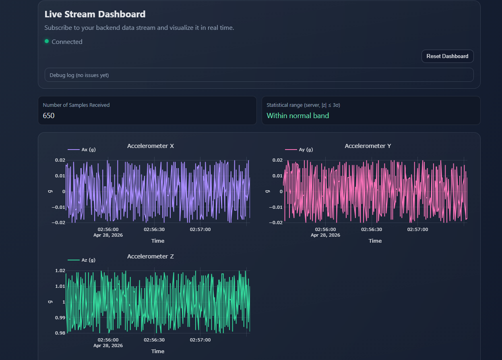

# Live IoT Dashboard

Real-time accelerometer dashboard with anomaly detection, powered by a Raspberry Pi Pico, MQTT, FastAPI, and Plotly.

## Overview

This project streams MPU6050 sensor data from a Pico device to an MQTT broker, applies server-side anomaly detection, then visualizes it in a live web dashboard.

Data flow:
`Pico (main.py) -> MQTT broker -> FastAPI service (dashboard_api.py) -> SSE (/stream) -> Plotly UI (templates/index.html)`

## Key Features

- Real-time X/Y/Z and combined acceleration charts
- MQTT ingestion with rolling in-memory buffer
- HTTP ingestion endpoint (`POST /ingest`) for external data sources
- Server-side anomaly indicators using z-score on prior samples
- Live updates via Server-Sent Events (`/stream`)
- Health and reset endpoints for operational control

## Project Structure

- `main.py`: MicroPython publisher for Raspberry Pi Pico + MPU6050
- `dashboard_api.py`: FastAPI backend, MQTT subscriber, anomaly enrichment, SSE
- `templates/index.html`: Single-page dashboard UI
- `requirements.txt`: Python dependencies
- `render.yaml`: Render deployment blueprint

Set these environment variables for MQTT integration:

| Variable | Default | Description |
|---|---|---|
| `MQTT_HOST` | - | MQTT broker host (required to enable subscriber) |
| `MQTT_PORT` | `8883` | MQTT broker port |
| `MQTT_TOPIC` | `iotproject/accelerometer` | Subscription topic |
| `MQTT_USERNAME` | - | Broker username |
| `MQTT_PASSWORD` | - | Broker password |
| `MQTT_USE_TLS` | `true` | Enable TLS |
| `MQTT_TLS_INSECURE` | `false` | Disable cert verification (development only) |
| `MQTT_CLIENT_ID` | auto | Optional MQTT client ID |

## Deployment 

1. Fork this repository 
2. Create a Render Web Service using `render.yaml` 
3. Set required environment variables (`MQTT_HOST`, credentials, topic settings)

## Screenshots

